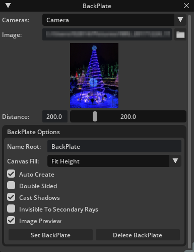

# Mead & Hunt BackPlate


## Inspiration
`BackPlate` was created based on the inspiration of the [Maya image plane](https://knowledge.autodesk.com/support/maya/learn-explore/caas/CloudHelp/cloudhelp/2022/ENU/Maya-LightingShading/files/GUID-F72F8E1B-EFFE-400E-BD92-5441BE9CD28F-htm.html) and [Martin Breidt's imagePlane](https://apps.autodesk.com/3DSMAX/en/Detail/Index?id=937735873795409037&appLang=en&os=Win64) maxscript.

It also provided me a chance to create a tool that is lacking in AEC Visualization, while learning Python, USD, and Kit APIs/workflows. Tools like Enscape, Twinmotion, and Lumion don't really have ways to easily align a real photo with your digital world and all lack a way to extend the tool. With Omniverse we have a way to extend our visualization tools, and BackPlate was born out of this.

## About
This tool was created so users can place a card with a background image (`BackPlate`) which is linked to the camera. These cards are typically used to align Omniverse cameras and models with real images. The card will match the original aspect ratio of the selected `Texture` and the user can select to maximize the `Height` or `Width` of the card to align with the viewport canvas. The card will properly scale based on the distance from the camera to ensure proper alignment. All materials are created by the tool using a `custom emissive-only MDL` file.

## Usage
After installation the dialog can be opened from **`Window > Mead & Hunt > BackPlate`**.



**Cameras:** Drop-down of all available perspective cameras.
- **`NOTE:`** Includes the viewport Perspective Camera `OmniverseKit_Persp`.

**Image:** Path to the texture to be assigned to the BackPlate object. Folder button will open `FilePickerDialog` filtered to image formats supported by Omniverse. 
- **`NOTE:`** The material created and assigned is a custom emissive-only mdl `(assets/BackPlate.mdl)` with the name matching the BackPlate object it is assigned to.

**Preview:** Preview of image selected.
- **`NOTE:`** Can be disabled in the BackPlate Options.

**Distance:** Controls for adjusting the distance from the Camera.
- **`NOTE:`** Controls are linked to allow for soft maximum ranges. Values entered into the `FloatField` greater than the maximum of the slider will grow the maximum by 10%, entering 2000 in the field will set the maximum to 2200.

**Name Root:** `'BackPlate' (default)` String added at the beginning of the mesh name followed by underscore and camera name, ex `BackPlate_Camera`.

**Canvas Fill:** Drop-down of canvas fit methods.
- `Fit Height (default):` Fits the image so the top/bottom aligns with the top/bottom of the viewport canvas.
- `Fit Width:` Fits the image so the left/right aligns with the left/right of the viewport canvas.

**Auto Create:** Toggle creating a BackPlate on the selected camera on any settings adjustment.
- `Enabled (default):` Any UI change (including selecting a new camera) will create a BackPlate.
- `Disabled:` BackPlate only created when `Set BackPlate` is pressed.

**Double Sided:** Toggle `Double Sided` option on the BackPlate material.
- `Enabled:` Material is Double Sided and shows the same on both sides.
- `Disabled (default):` Material is Single Sided showing the image facing the camera and Black on the back.

**Cast Shadows:** Toggle `Cast Shadows` on the BackPlate Mesh object.
- `Enabled (default):` Mesh cast shadows.
- `Disabled:` Mesh ***`does not`*** cast shadows.

**Invisible To Secondary Rays:** Toggle `Invisible To Secondary Rays` on the BackPlate Mesh object.
- `Enabled:` Mesh ***`is not`*** visible to secondary rays (reflection, refraction, GI, etc).
- `Disabled (default):` Mesh ***`is`*** visible to secondary rays (reflection, refraction, GI, etc).

**Image Preview:** Toggle `Preview` below the image input field.
- `Enabled (default):` Preview ***'is'*** shown.
- `Disabled:` Preview ***'is not'*** shown, and the preview area is collapsed.

**Set BackPlate:** Button to manually create a New BackPlate.
- **`NOTE:`** Set BackPlate should be used when `Auto Create` is disabled.

**Delete BackPlate:** Button to manually delete the BackPlate and assigned Material attached to selected Camera.

## Adding This Extension
To add this extension to your Omniverse app:
1. Go into: Extension Manager -> Gear Icon -> Extension Search Path
2. Add this as a search path: `git://github.com/ericcraft-mh/meadhunt-mesh-backplate.git?branch=main&dir=exts`

## To-Do List
- Update BackPlate on Camera parameter changes.
- Implement in viewport controls for adjusting BackPlate.

## App Link Setup
If `app` folder link doesn't exist or broken it can be created again. For better developer experience it is recommended to create a folder link named `app` to the *Omniverse Kit* app installed from *Omniverse Launcher*. Convenience script to use is included.

Run:

```
> link_app.bat
```

If successful you should see `app` folder link in the root of this repo.

If multiple Omniverse apps is installed script will select recommended one. Or you can explicitly pass an app:

```
> link_app.bat --app create
```

You can also just pass a path to create link to:

```
> link_app.bat --path "C:/Users/bob/AppData/Local/ov/pkg/create-2021.3.4"
```

## Contributing
The source code for this repository is provided as-is, but I am accepting outside contributions.

Issues, Feature Requests, and Pull Requests are welcomed.

