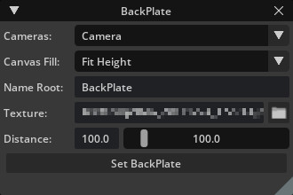

# Mead & Hunt Backplate


## About
This tool was created to mimic the features and usage of the [Maya image plane](https://knowledge.autodesk.com/support/maya/learn-explore/caas/CloudHelp/cloudhelp/2022/ENU/Maya-LightingShading/files/GUID-F72F8E1B-EFFE-400E-BD92-5441BE9CD28F-htm.html) and [Martin Breidt's imagePlane](https://apps.autodesk.com/3DSMAX/en/Detail/Index?id=937735873795409037&appLang=en&os=Win64) maxscript.

## Usage
After installation the dialog can be opened from **`Window > Mead & Hunt > BackPlate`**.



**Cameras:** Drop-down of all available perspective cameras.
- **`NOTE:`** Includes the viewport Perspective Camera `OmniverseKit_Persp`.

**Canvas Fill:** Drop-down of canvas fit methods.
- `Fit Height (default):` Fits the image so the top/bottom aligns with the top/bottom of the viewport canvas.
- `Fit Width:` Fits the image so the left/right aligns with the left/right of the viewport canvas.

**Name Root:** `'BackPlate' (default)` String added at the beginning of the mesh name followed by underscore and camera name, ex `BackPlate_Camera`.

**Texture:** Path to the texture to be assigned to the BackPlate object. Folder button will open `FilePickerDialog` filtered to image formats supported by Omniverse. 
- **`NOTE:`** The material created and assigned is a custom emissive mdl shader `(assets/BackPlate.mdl)` with the name matching the BackPlate object.

**Distance:** Controls for adjusting the distance from the Camera.
- **`NOTE:`** Controls are linked to allow for soft maximum ranges. Values entered into the `FloatField` greater than the maximum of the slider will grow the maximum by 10%, entering 2000 in the field will set the maximum to 2200.

**Set BackPlate:** Button to manually create a New BackPlate.
- **`NOTE:`** BackPlate should be dynamically created whenever an adjustment is made to the UI.


## Adding This Extension
To add this extension to your Omniverse app:
1. Go into: Extension Manager -> Gear Icon -> Extension Search Path
2. Add this as a search path: `git://github.com/ericcraft-mh/meadhunt-mesh-backplate.git?branch=main&dir=exts`


## App Link Setup
If `app` folder link doesn't exist or broken it can be created again. For better developer experience it is recommended to create a folder link named `app` to the *Omniverse Kit* app installed from *Omniverse Launcher*. Convenience script to use is included.

Run:

```
> link_app.bat
```

If successful you should see `app` folder link in the root of this repo.

If multiple Omniverse apps is installed script will select recommended one. Or you can explicitly pass an app:

```
> link_app.bat --app create
```

You can also just pass a path to create link to:

```
> link_app.bat --path "C:/Users/bob/AppData/Local/ov/pkg/create-2021.3.4"
```


## Contributing
The source code for this repository is provided as-is, but I am accepting outside contributions.

Issues, Feature Requests, and Pull Requests are welcomed.

